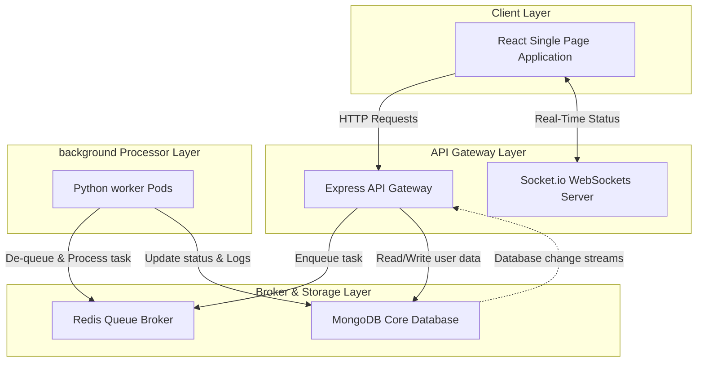
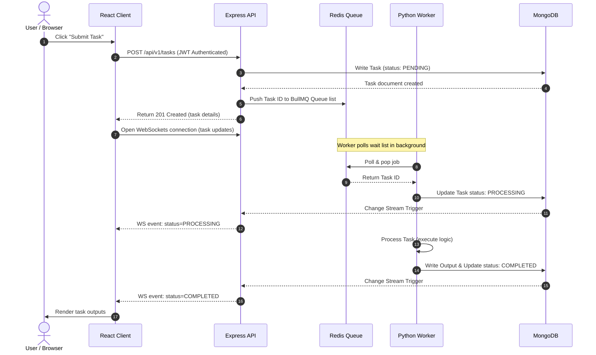

# System Architecture Specification — AI Task Processing Platform

This document details the high-level architecture, subsystem boundaries, data design, container setups, deployment orchestrations, scaling logic, and security layers of the AI Task Processing Platform.

---

## 1. High-Level Architecture

The platform follows a **decoupled asynchronous architecture** containing an API gateway (Backend), a browser client (Frontend), a messaging queue broker (Redis), a persistent datastore (MongoDB), and horizontal worker nodes (Python Workers).



---

## 2. Sequence Diagram

The diagram below maps the runtime lifecycle of a task execution:



---

## 3. Database Design

We use MongoDB as our persistent document store. The schema is optimized for write-heavy logging operations.

### collections layout

#### `users` Collection
- **Description**: Stores user login credentials and profile metadata.
- **Fields**:
  - `_id`: ObjectId (Primary Key)
  - `username`: String (Unique, indexed)
  - `email`: String (Unique, indexed)
  - `password`: String (Salted bcrypt hash)
  - `createdAt`: Date
  - `updatedAt`: Date

#### `tasks` Collection
- **Description**: Stores task job descriptions, input parameters, processing states, and execution output files.
- **Fields**:
  - `_id`: ObjectId (Primary Key)
  - `userId`: ObjectId (Foreign Key references `users._id`, indexed)
  - `type`: String (e.g. `WORD_COUNT`, `IMAGE_RESIZE`)
  - `status`: String (Enum: `PENDING`, `PROCESSING`, `COMPLETED`, `FAILED`)
  - `payload`: Object (Input parameters: file path, search term, configurations)
  - `result`: Object (Processing metrics, output data paths)
  - `error`: String (Details if status is `FAILED`)
  - `createdAt`: Date
  - `updatedAt`: Date

---

## 4. Redis Queue & Python Worker Architecture

### Redis Queue Structure
- The messaging engine uses **BullMQ** on Node.js to manage queues. Under the hood, BullMQ structures queue metadata in Redis keys:
  - `bull:ai-tasks-queue:wait` (Redis List): Contains IDs of tasks waiting to be processed.
  - `bull:ai-tasks-queue:active` (Redis Set): Contains IDs of tasks currently locked by workers.
  - `bull:ai-tasks-queue:stalled` (Redis Set): Contains IDs of tasks that crashed.
- **Dynamic Mock Mode**: If the Express server fails to communicate with Redis at port 6379, it sets a global flag `isRedisMock = true`. The gateway falls back to writing tasks to MongoDB, and worker nodes poll MongoDB directly using timed queries. This guarantees server uptime.

### Python Worker Architecture
- Built with Python 3.11 for performance optimization.
- Instantiates separate managers (`MongoManager` and `RedisManager`) to handle connections.
- Implements signals handles (`SIGINT`, `SIGTERM`) for graceful shutdowns (stops picking new tasks, closes DB socket pools, exits).

---

## 5. Container & Orchestration Architectures

### Docker Multi-Stage Builds
- **Backend (Node.js)**: Build compiles all modules. The production pruner strips out devDependencies. The final Alpine container runs as unprivileged user `node`.
- **Frontend (React)**: Node builder compiles Vite assets. The Nginx server serves static files. The Nginx config runs as unprivileged user `nginx` (UID 101) on port 8080.
- **Worker (Python)**: Builder compiles native dependencies using build-essential. Final Slim runner copies packages into the unprivileged `worker` user (UID 10001) namespace.

### Kubernetes Deployment Topology
- **Isolation**: Everything runs in the dedicated namespace `ai-task-platform`.
- **Services (ClusterIP)**: Restricts DB ports (27017, 6379) inside the private overlay network. Only the `frontend` (port 80) and `backend` (port 5000) are exposed to the ingress.
- **Ingress (NGINX Ingress Controller)**: Configured with distinct routing rules under `ai-task-platform.local`. Implements regex capture-group rewrites and security configurations directly at the proxy layer.

---

## 6. Continuous Integration & GitOps Workflows

```text
    Developer -> commits code to GitHub Repo
                      |
                      v
    GitHub Actions compiles and runs testing pipelines
                      |
                      +---> Builds Docker images
                      +---> Pushes tags (sha-<commit>) to Docker Hub
                      |
    GitHub Actions commits updated image tags to Infrastructure Repository
                      |
                      v
    Argo CD syncs the cluster state to match the Infrastructure Repository
                      |
                      v
    Kubernetes rolls out container updates (Rolling Updates)
```

- **Argo CD reconciliations**: Auto-prunes deleted files, auto-heals drifted parameters from manual overrides, and handles namespaces and retries dynamically.

---

## 7. Scaling & Load Balancing Strategy

- **API Layer**: Autoscales via **HPA** targeting CPU $\ge$ 70% and Memory $\ge$ 80% (scales between 2 and 5 replicas).
- **Background Worker Layer**: Autoscales via **KEDA** ScaledObject. Polling Redis list length `bull:ai-tasks-queue:wait` every 30s. Automatically scales worker replicas from **1 to 10** (1 pod per 5 waiting tasks), resolving throughput spikes up to **10 tasks/second**.

---

## 8. Security & Observability

### Security
1. **Network Security**: Databases do not expose public ports; ingress filters all traffic.
2. **Container Security**: Mandatory unprivileged execution contexts. Read-only filesystem layers where applicable.
3. **Application Security**: Encrypted JWT payload headers, salted password hashes using Bcrypt, and API gateway rate limiters (max 100 requests per 15 minutes).

### Observability & Monitoring (Recommended stack)
- **Log Collection**: FluentBit agent running as DaemonSet routing stdout streams to Elasticsearch.
- **Metrics Collection**: Prometheus querying Kubernetes metrics-server API scraping cpu, memory, and network throughputs.
- **Alerting**: Grafana dashboards tracking worker queue backlog sizes, triggering Slack notifications if backlog exceeds 50 items.
